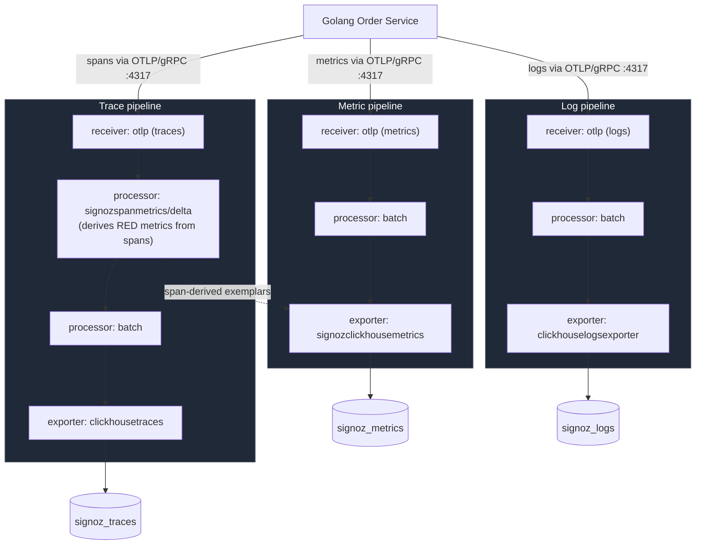
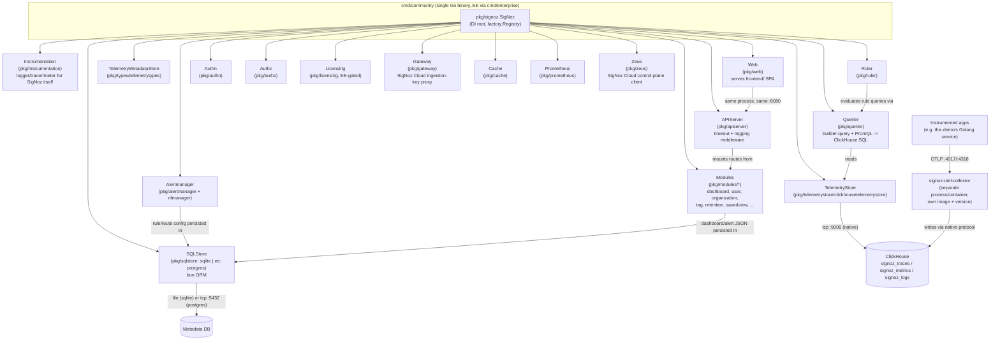
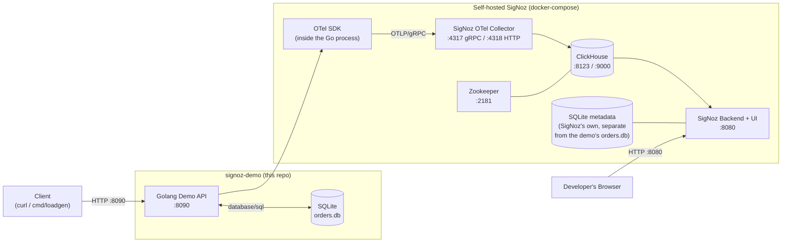

# SigNoz — Full Architecture (Single Reference Document)

This is the consolidated, single-file version of this project's SigNoz
architecture research: the full written analysis **and** all five Mermaid
diagrams, in one place, in reading order. It was produced by cloning and
reading `github.com/SigNoz/signoz` directly (module `github.com/SigNoz/signoz`,
`go.mod` pinned to Go 1.25.7) — not from memory of older tutorials, several
of which describe a deployment topology that no longer exists (see §5).

The per-topic source files this document draws from, if you want the
narrower version of any one piece:

- [`docs/signoz-architecture.md`](signoz-architecture.md) — the same
  material, split into its original research sections.
- [`docs/diagrams/`](diagrams/) — each diagram below as its own standalone
  file, for embedding/rendering individually.

Every claim is tagged **[SOURCE]** (verified by reading the named
file/directory), **[DEMO]** (how this repo's own Golang service uses it), or
**[SIMPLIFICATION]** (a deliberate simplification, called out explicitly so
it's never mistaken for a SigNoz fact).

## Table of Contents

1. [Repository directory map](#1-repository-directory-map)
2. [Diagram 1 — High-level architecture](#2-diagram-1--high-level-architecture)
3. [Diagram 2 — Telemetry ingestion pipeline](#3-diagram-2--telemetry-ingestion-pipeline)
4. [Diagram 3 — Trace request flow](#4-diagram-3--trace-request-flow-this-demos-order-service)
5. [Diagram 4 — SigNoz internal components](#5-diagram-4--signoz-internal-component-architecture)
6. [Diagram 5 — Local development architecture](#6-diagram-5--local-development-architecture-this-repo)
7. [Component-by-component: ingestion, storage, query, alerting, auth, deployment](#7-component-by-component)
8. [The self-hosting method changed under our feet](#8-the-self-hosting-method-changed-under-our-feet--a-real-finding)
9. [Core framework internals: factory, config, errors](#9-core-framework-internals-factory-config-errors)
10. [Query language: three ANTLR grammars, compiled twice](#10-query-language-three-antlr-grammars-compiled-twice)
11. [Query schema versioning](#11-query-schema-versioning-pkgtransition)
12. [Supporting packages](#12-supporting-packages-worth-knowing)
13. [Frontend architecture](#13-frontend-architecture-frontend)
14. [Testing architecture](#14-testing-architecture-tests)
15. [What's DEMO vs. SIMPLIFICATION here](#15-whats-demo-vs-simplification-in-this-repository)

---

## 1. Repository directory map

| Path | What it is | Why it matters |
| --- | --- | --- |
| `cmd/community/main.go`, `server.go` | Entry point for the OSS binary. Registers the `server`, `generate`, and `metastore` CLI commands, then calls `cmd.Execute`. | Confirms SigNoz OSS ships as **one Go binary**, not micro-per-signal services. |
| `cmd/enterprise/` | Entry point for the licensed build; wires the same `pkg/signoz.New(...)` constructor with EE-only factory callbacks (`ee/modules/*`, `ee/sqlstore/postgressqlstore`, `ee/licensing`, …). | Shows OSS vs. Enterprise is a **compile-time factory swap**, not a different codebase fork. |
| `pkg/signoz/signoz.go` | The `SigNoz` struct — the dependency-injection root. Every subsystem (`SQLStore`, `TelemetryStore`, `Querier`, `Alertmanager`, `Ruler`, `Gateway`, `Web`, `APIServer`, …) is a field populated by a `factory.ProviderFactory`. | This **is** the architecture diagram in code form — Diagram 4 is a direct transcription of this struct's fields and their constructors. |
| `pkg/factory/` | The provider/factory DI framework used everywhere. See §9. | Explains *how* SigNoz wires ~40 subsystems without a global `init()` soup. |
| `pkg/config/` | URI-scheme-based config resolver. See §9. | Config precedence is per-scheme provider dispatch, not a fixed file-then-env chain. |
| `pkg/errors/` | Shared typed-error framework: category + stable code + centralized HTTP mapping. See §9. | The one place "what HTTP status does a not-found error get" is decided, repo-wide. |
| `pkg/querier/` | Query engine: builder-query DSL → ClickHouse SQL, PromQL → ClickHouse SQL. | What dashboards, alerts, and the Query Builder UI actually call — one engine, all three signal types. |
| `pkg/telemetrystore/` + `pkg/telemetrystore/clickhousetelemetrystore/` | Abstraction over the **telemetry** database (ClickHouse). Separate from `pkg/sqlstore`. | Confirms the two-database split: metadata vs. telemetry. |
| `pkg/sqlstore/` (`bun.go`, `sqlitesqlstore/`) + `ee/sqlstore/postgressqlstore/` | Abstraction over the **metadata** database (users, orgs, dashboards, alert rules, API keys, saved views) using the `bun` ORM. SQLite ships in OSS; Postgres is an Enterprise option. | Not where traces/metrics/logs live — a common point of confusion. |
| `pkg/telemetrytraces/`, `pkg/telemetrymetrics/`, `pkg/telemetrylogs/`, `pkg/telemetrymeter/` | Per-signal field mappers and query-builder glue. | Where a new attribute/semantic-convention field gets wired into the Query Builder. |
| `pkg/ruler/` + `pkg/alertmanager/` | Rule evaluation + notification routing/dispatch. Config persisted in SQLStore, not ClickHouse. | Alerting is two cooperating subsystems, not one. |
| `pkg/authn/`, `pkg/authz/`, `pkg/modules/user`, `pkg/modules/organization` | Authentication, authorization (RBAC), user/org domain modules. | Auth is modular — Enterprise swaps in SSO/RBAC providers via callback, without touching OSS code. |
| `pkg/web/` (`routerweb/`) | Serves the built `frontend/` static assets behind `apiserver`'s router. | Frontend and API are served from the **same process/port**, not two containers. |
| `pkg/apiserver/` | Cross-cutting HTTP middleware: per-route timeout, logging exclusions. | Explains why `/api/v1/logs/tail` streams instead of timing out. |
| `pkg/gateway/` | Proxies ingestion-key management to SigNoz Cloud's Zeus backend. | A SaaS-integration surface, not a general API gateway — self-hosted OSS doesn't need it for basic ingestion. |
| `pkg/query-service/app/services/map.go` | Service Map computation, still under the legacy package path. | Derived from span relationships already in ClickHouse traces — a query, not a stored graph. |
| `pkg/instrumentation/` | SigNoz's own OpenTelemetry setup (it dogfoods itself). | Directly comparable to this demo's `pkg/observability`. |
| `grammar/` (`FilterQuery.g4`, `HavingExpression.g4`, `TraceOperatorGrammar.g4`) | ANTLR4 grammars for the Query Builder filter syntax, compiled to **both** Go and TypeScript. See §10. | Frontend and backend can never silently disagree on filter syntax. |
| `pkg/transition/` | v4 ↔ v5 query-schema migration for dashboards/alerts/saved views. See §11. | The on-disk query representation is a versioned schema, not assumed-current JSON. |
| `frontend/` | The React SPA. See §13. | Frontend↔backend contract is codegen on both ends. |
| `tests/integration/`, `tests/e2e/`, `tests/seeder/` | Go integration tests, Playwright e2e, Python golden-fixture seeder. See §14. | The integration-test directory list is itself a map of what SigNoz treats as integration-critical. |
| `conf/example.yaml` | Every subsystem's config keys in one file. Confirms default `external_url: http://localhost:8080`. | Use this file to find any config key without guessing. |
| `.devenv/docker/` (`clickhouse/`, `postgres/`, `signoz-otel-collector/`) | The **real current local-dev stack** used by SigNoz's own contributors — not a root `docker-compose.yaml`. | This demo's `docker-compose.yml` mirrors this shape. |
| `deploy/` | Only `install.sh`, `README.md`, `MIGRATION.md` — no bundled compose file, and `install.sh` itself just prints a deprecation notice. See §8. | The classic self-host method is gone, replaced by Foundry. |

---

## 2. Diagram 1 — High-Level Architecture

Traces, metrics, and logs from instrumented applications flow through OTLP
into the SigNoz Collector, land in ClickHouse, and are queried back out by
the unified SigNoz backend for the UI.

```mermaid
flowchart LR
    subgraph Apps["Applications / Microservices"]
        A1["Golang Order Service<br/>(this demo)"]
        A2["Other instrumented services"]
    end

    subgraph SDK["OpenTelemetry SDK"]
        S1["TracerProvider"]
        S2["MeterProvider"]
        S3["LoggerProvider"]
    end

    A1 -->|"instrumented calls"| S1
    A1 --> S2
    A1 --> S3
    A2 --> S1

    S1 -->|"OTLP/gRPC :4317<br/>or OTLP/HTTP :4318"| OTLP["OTLP"]
    S2 --> OTLP
    S3 --> OTLP

    OTLP --> COL["SigNoz OTel Collector<br/>(signoz-otel-collector)"]

    subgraph Pipeline["Processing Pipeline"]
        P1["receivers: otlp, prometheus"]
        P2["processors: signozspanmetrics,<br/>resourcedetection, batch"]
        P3["exporters: clickhousetraces,<br/>signozclickhousemetrics,<br/>clickhouselogsexporter"]
    end

    COL --> P1 --> P2 --> P3

    P3 -->|"traces"| CH1[("ClickHouse<br/>signoz_traces")]
    P3 -->|"metrics"| CH2[("ClickHouse<br/>signoz_metrics")]
    P3 -->|"logs"| CH3[("ClickHouse<br/>signoz_logs")]

    subgraph Backend["SigNoz Backend (single Go binary)"]
        Q["Querier<br/>(builder-query DSL + PromQL)"]
        API["API Server + Web<br/>(pkg/apiserver, pkg/web) :8080"]
        META[("SQLStore<br/>SQLite/Postgres<br/>users, dashboards, alert rules")]
        RULER["Ruler + Alertmanager<br/>(alerting)"]
    end

    CH1 --> Q
    CH2 --> Q
    CH3 --> Q
    Q --> API
    META <--> API
    Q --> RULER
    RULER --> META

    UI["SigNoz UI<br/>(frontend/, served by pkg/web)"]
    API --> UI
    UI -->|"HTTP :8080"| Browser["Browser"]
```



Ports, component names, and the OTLP→Collector→ClickHouse→Querier→API/UI
flow are verified from source (§7). "Other instrumented services" is
illustrative only — this demo ships one Golang service.

---

## 3. Diagram 2 — Telemetry Ingestion Pipeline

How each signal travels from an instrumented application into SigNoz's
storage, shown as three parallel lanes through the same collector.



Verified from `.devenv/docker/signoz-otel-collector/otel-collector-config.yaml`:
all three signals arrive over the **same** OTLP receiver (`grpc: 0.0.0.0:4317`,
`http: 0.0.0.0:4318`) — the "lanes" are pipeline names in the collector's
`service.pipelines` config, not separate network listeners. `signozspanmetrics/delta`
is the one processor that bridges traces → metrics, computing latency
histograms and request/error counts from spans — this is how SigNoz gets
RED-method service metrics without the app emitting them directly. A
`prometheus` receiver also feeds the metrics pipeline (self-scraping the
collector's own `:8888` metrics), omitted above since it's not part of the
application's data path.

---

## 4. Diagram 3 — Trace Request Flow (this demo's Order Service)

A concrete `POST /api/v1/orders` request, showing the hexagonal layers each
span represents and how the trace context propagates to SigNoz.

```mermaid
sequenceDiagram
    participant C as Client
    participant H as HTTP Adapter<br/>(internal/adapters/http)
    participant U as Use Case<br/>(internal/application)
    participant R as Repository Adapter<br/>(internal/adapters/sqlite)
    participant DB as SQLite
    participant OTel as OTel SDK<br/>(TracerProvider)
    participant Col as SigNoz OTel Collector

    C->>H: POST /api/v1/orders
    activate H
    H->>OTel: start span "POST /api/v1/orders"<br/>(root, http.method, http.route)
    H->>U: CreateOrder(ctx, cmd)
    activate U
    U->>OTel: start child span "OrderService.CreateOrder"<br/>(order attributes, no PII)
    U->>R: Save(ctx, order)
    activate R
    R->>OTel: start child span "sqlite.INSERT orders"<br/>(db.system=sqlite, db.operation=INSERT)
    R->>DB: INSERT INTO orders (...)
    DB-->>R: rows affected / error
    R->>OTel: end span (status: OK or ERROR)
    deactivate R
    R-->>U: order, err
    U->>OTel: end span
    deactivate U
    U-->>H: result, err
    H->>OTel: end root span (http.status_code)
    deactivate H
    H-->>C: 201 Created / 4xx / 5xx

    OTel-->>Col: batched spans exported via OTLP/gRPC :4317
    Note over OTel,Col: context propagation keeps all 3 spans<br/>under one trace_id; parent/child links<br/>let SigNoz render the waterfall.
```

This demonstrates parent/child spans (HTTP → Use Case → Repository, one
`trace_id`); context propagation (`context.Context` threaded explicitly
through every layer — the domain layer never imports `context` for tracing,
only the adapters do); error spans (a failed `INSERT` sets
`span.SetStatus(codes.Error, ...)` and records the error as a span event);
and slow requests/DB latency (an artificial delay in
`internal/adapters/sqlite`, used only by the `slow` demo scenario, shows up
as extra duration on the `sqlite.INSERT orders` span specifically — the
debugging signal the companion blog post walks through).

---

## 5. Diagram 4 — SigNoz Internal Component Architecture

Transcribed directly from `pkg/signoz/signoz.go`'s `SigNoz` struct and the
factories it wires in `signoz.New(...)`. Component names are the actual Go
package/struct names — nothing invented.



There is **no separate "query-service" microservice anymore** — that
legacy package path (`pkg/query-service/app`) still contains some handlers
(e.g. Service Map), but it compiles into the same binary as everything
else. The **Collector is architecturally decoupled** from the SigNoz
binary — a different repo entirely, connected only via ClickHouse and
OTLP. **Licensing/Gateway/Zeus** are SaaS-integration surfaces present even
in the OSS binary (feature-gated), which is why `cmd/enterprise` is a thin
wrapper rather than a separate codebase.

---

## 6. Diagram 5 — Local Development Architecture (this repo)

What actually runs on a laptop when you follow this repo's README: the demo
API + its own SQLite business database, plus a self-hosted SigNoz stack
modeled on `.devenv/docker/` from the SigNoz repo.



The demo API's `orders.db` (business data) and SigNoz's own metadata SQLite
file are two unrelated SQLite databases, drawn separately on purpose. This
diagram matches `docker-compose.yml` in this repo: `app`,
`signoz-otel-collector`, `clickhouse`, `zookeeper` services. The `SigNoz
Backend + UI` box is provisioned via **Foundry**
(`signoz.io/docs/install/docker/`), not a hand-rolled compose service — see
§8 for why. A production deployment would use Foundry/Kubernetes and
typically Postgres for metadata + a multi-node ClickHouse cluster — not
shown here, out of scope for a local demo.

---

## 7. Component-by-component

### 7.1 signoz-otel-collector (ingestion)

- **What it does**: receives OTLP traces/metrics/logs, computes span→metrics
  (RED metrics: rate/errors/duration) via the `signozspanmetrics` processor,
  batches, and writes to ClickHouse. **[SOURCE: `.devenv/docker/signoz-otel-collector/otel-collector-config.yaml`]**
- **Where**: not in this Go module at all — a separate binary/image
  (`signoz/signoz-otel-collector:v0.14x`), a SigNoz-maintained distribution
  of the upstream OpenTelemetry Collector with custom exporters
  (`clickhousetraces`, `signozclickhousemetrics`, `clickhouselogsexporter`)
  and a custom processor (`signozspanmetrics`).
- **Protocols/ports**: OTLP/gRPC `4317`, OTLP/HTTP `4318`, health-check
  extension `13133`, pprof `1777`; self-scrapes its own Prometheus metrics
  on `8888` via the `prometheus` receiver.
- **Reads/writes**: reads OTLP from instrumented apps; writes to three
  ClickHouse databases — `signoz_traces`, `signoz_metrics`, `signoz_logs`.
- **Sync/async**: the OTLP receiver ack's synchronously per batch, but the
  pipeline is async/buffered (`batch` processor, `send_batch_size: 10000`,
  `timeout: 10s`).
- **Schema migrations**: the same binary doubles as a migration tool —
  `migrate bootstrap && migrate sync up && migrate async up` — run once
  against ClickHouse before serving traffic.

### 7.2 ClickHouse (telemetry storage)

- **What it does**: columnar store for all telemetry, chosen for
  high-cardinality, high-volume analytical queries. **[SOURCE: root `README.md`]**
- **Where**: `pkg/telemetrystore/clickhousetelemetrystore/`.
- **Ports**: HTTP `8123`, native protocol `9000`.
- **Coordination**: `zookeeper` (`signoz/zookeeper:3.7.1`) is a dependency
  of ClickHouse for replicated/clustered tables, even in the single-node
  dev compose.
- **Extra**: a `histogramQuantile` user-defined function binary is fetched
  and mounted into ClickHouse's `user_scripts`, used for latency percentile
  queries server-side.

### 7.3 SQLStore (metadata storage)

- **What it does**: stores everything that is *not* telemetry — users,
  organizations, dashboards (definitions, not data), alert rules,
  notification routes, API keys, saved views, service accounts.
  **[SOURCE: `pkg/sqlstore/bun.go`, `pkg/sqlstore/sqlitesqlstore/`, `ee/sqlstore/postgressqlstore/`]**
- **Where**: SQLite by default in the OSS binary; Postgres available as the
  Enterprise/self-hosted metadata backend.
- **Easy to miss**: a request that "saves a dashboard" writes JSON into
  SQLStore; a request that "runs a dashboard panel" queries TelemetryStore
  (ClickHouse) through `pkg/querier`. Two different databases, one HTTP
  request.

### 7.4 Querier (query engine)

- **What it does**: single query engine behind dashboards, alerts, and the
  Query Builder UI. Accepts either SigNoz's builder-query DSL or raw
  PromQL, translating both into ClickHouse SQL against the three telemetry
  databases. **[SOURCE: `pkg/querier/`]**
- **Field mapping**: `pkg/telemetrytraces`, `pkg/telemetrymetrics`,
  `pkg/telemetrylogs` each provide a `field_mapper.go` translating a
  logical/semantic field name to the physical ClickHouse column + table.

### 7.5 Alerting (Ruler + Alertmanager)

- **Ruler** (`pkg/ruler/`) periodically evaluates alert rule queries
  through `Querier` and fires alert state transitions.
- **Alertmanager** (`pkg/alertmanager/` + `nfmanager`) receives fired
  alerts and dispatches notifications; config/state persisted in
  **SQLStore**, not ClickHouse.
- **Sync/async**: rule evaluation is a background polling scheduler;
  notification dispatch is fire-and-forget async delivery.

### 7.6 Dashboards, Service Map, Exceptions

- **Dashboards**: `pkg/modules/dashboard` stores dashboard JSON via
  SQLStore; rendering panel data goes through `Querier` → ClickHouse.
- **Service Map**: `pkg/query-service/app/services/map.go` derives the
  service dependency graph from span `service.name` and
  parent/child/peer relationships already in `signoz_traces` — a *query*,
  not a separately maintained graph store.
- **Exceptions**: modeled as span events on traces (OTel's own
  `exception.type`/`exception.message`/`exception.stacktrace` semantic
  conventions) — no separate "exceptions" table family, it rides on the
  traces pipeline.

### 7.7 Auth & Authorization

- `pkg/authn` — pluggable authentication providers (Enterprise registers
  SSO providers on top of OSS password auth via a callback).
- `pkg/authz` — RBAC provider, swappable for Enterprise policy engines.
- `pkg/modules/user`, `pkg/modules/organization` — domain modules for
  user/org lifecycle.

### 7.8 API server + Web (frontend)

- `pkg/apiserver` is cross-cutting HTTP middleware only (timeout policy,
  logging exclusions) — route handlers live per-module.
- `pkg/web` serves the compiled `frontend/` SPA from the **same process**
  as the API, behind the same port. Default: `http://localhost:8080`.
- Conventional synchronous HTTP, except long-lived routes explicitly
  excluded from the timeout middleware (`/api/v1/logs/tail`,
  `/api/v3/logs/livetail`, `/api/v1/export_raw_data`), which stream.

### 7.9 Deployment topology (current)

`cmd/community` → `pkg/signoz.New(...)` wires one process exposing API +
Web on `:8080`, talking to SQLStore (metadata, synchronous) and
TelemetryStore (ClickHouse, synchronous per-request reads; async/batched
ingestion via the separate collector). The **signoz-otel-collector** is a
separate deployable unit in every topology — never compiled into the
`signoz` binary.

---

## 8. The self-hosting method changed under our feet — a real finding

We initially expected (like most existing SigNoz blog posts) to
`docker compose up` a root-level compose file bundling ClickHouse + the
collector + the SigNoz app + the frontend. That file does not exist in the
current repository. Instead:

- `deploy/install.sh` — the script every older tutorial says to
  `curl | bash` — **now only prints a deprecation notice and exits**:
  *"This install script has been deprecated and is no longer maintained...
  Please follow the latest installation instructions here:
  https://signoz.io/docs/install/docker/"* **[SOURCE: `deploy/install.sh`]**
- `deploy/README.md` confirms the replacement is **Foundry**
  (`github.com/SigNoz/foundry`), with a `MIGRATION.md` for teams moving an
  existing Compose deployment over. **[SOURCE]**
- The **only** docker-compose fragments left in the repository are under
  `.devenv/docker/` — the **contributor dev environment**: ClickHouse +
  Zookeeper + the collector in Docker, while the SigNoz Go binary itself
  runs natively (`go run ./cmd/community server`) so a contributor can
  attach a debugger. There is no `.devenv` service for the SigNoz app/UI
  itself. **[SOURCE]**

**What this means for this demo**: `docker-compose.yml` in this repo
honestly mirrors what exists in the SigNoz source today — it stands up
ClickHouse + the collector (adapted from `.devenv/docker/`) as the
*telemetry backend*. For the SigNoz application itself, we point readers
at the current official method — Foundry — rather than inventing an
unverified Docker image name/tag for it. **[DEMO]**

---

## 9. Core framework internals: factory, config, errors

**`pkg/factory`** — the dependency-injection core. `factory.NewRegistry(ctx,
logger, services...)` takes every subsystem as a `NamedService` (each
declares `Name()` and `DependsOn()`), builds a dependency graph, and
**cycle-detects it using `gonum.org/v1/gonum/graph/topo`** — a real graph
library, not a hand-rolled DFS. A self-dependency or dependency on an
unregistered service is logged and dropped, not fatal; a genuine cycle is a
startup error. This is what lets `pkg/signoz.New(...)` wire ~40 subsystems
in one call without manually ordering `Start()`/`Stop()`.

**`pkg/config`** — configuration is **URI-scheme-based**. `ResolverConfig.Uris`
is a list of `"<scheme>:<value>"` strings (RFC 3986), and `Resolver`
dispatches each URI to whichever registered `Provider` claims that scheme,
then **merges** all resulting `Conf` objects in order. Config can come from
a YAML file *and* environment overrides *and* other sources simultaneously
— each is a different scheme resolved into the same merged `Conf`, not a
hardcoded "file, then env" chain.

**`pkg/errors`** — a shared typed-error framework instead of raw
`errors.New`/`fmt.Errorf`. Two orthogonal axes: `typ` (category —
`TypeInvalidInput`, `TypeNotFound`, `TypeUnauthenticated`, `TypeForbidden`,
`TypeTooManyRequests`, `TypeLicenseUnavailable`, `TypeFatal`, …) and `Code`
(a stable machine-readable string per error site, regex-validated). One
file (`pkg/errors/http.go`) maps `typ` → HTTP status centrally — not a
`switch` copied into every handler.

---

## 10. Query language: three ANTLR grammars, compiled twice

SigNoz's Query Builder filter syntax (e.g.
`service.name = "checkout" AND http.status_code >= 500`) is a real grammar,
defined once and compiled **twice**:

- `grammar/FilterQuery.g4` — the general attribute-filter expression
  language (parentheses > NOT > AND > OR, consecutive expressions
  implicitly AND'd).
- `grammar/HavingExpression.g4` — the same shape, scoped to
  post-aggregation `HAVING`-style filters.
- `grammar/TraceOperatorGrammar.g4` — a distinct grammar for the Trace
  Operator / trace-funnel expression language.

```bash
antlr4 -Dlanguage=Go         -o <go output dir>    grammar/FilterQuery.g4 -visitor
antlr4 -Dlanguage=TypeScript -o frontend/src/parser grammar/FilterQuery.g4 -visitor
```

**[SOURCE]** confirmed by `frontend/src/parser/FilterQuery{Lexer,Parser,Visitor,Listener}.ts`
existing alongside ANTLR `.interp`/`.tokens` artifacts, and by
`scripts/grammar/generate-frontend-parser.sh`'s literal
`antlr4 -Dlanguage=TypeScript` invocation. The frontend gets real-time
syntax validation/autocomplete from the **identical grammar** the backend
uses to parse the same filter string server-side (`pkg/queryparser`,
`pkg/querybuilder`) — there is no risk of the client accepting syntax the
server then rejects, because it's the same grammar file, not two
hand-maintained parsers kept in sync by convention.

---

## 11. Query schema versioning (`pkg/transition`)

`pkg/transition/{migrate_dashboard,migrate_alert,migrate_saved_view,v5_to_v4}.go`
migrate persisted dashboards/alerts/saved views between query-schema
versions ("v4" and "v5" shapes — `migrate_common.go`'s `WrapInV5Envelope`
normalizes an older query map into the current
`{name, disabled, legend, expression, functions, ...}` v5 shape, detecting
`builder_formula` vs. plain builder queries by whether `name` differs from
`expression`). **[SOURCE]** The Query Builder's on-disk query
representation is a versioned schema that has evolved at least once, with
first-class migration code — not "just re-save it."

---

## 12. Supporting packages worth knowing

- **`pkg/units`** — maps OpenTelemetry/Prometheus-style unit strings
  (`"ms"`, `"By"`, `"Mbit/s"`, `"percent"`, …) to one of a handful of
  formatters (duration/data/data-rate/percent/bool/none), so dashboard
  panel values render consistently regardless of recorded unit.
- **`pkg/variables`** — dashboard template variables. `ReservedTimeVars`
  (`start_timestamp`, `SIGNOZ_START_TIME`, `SIGNOZ_END_TIME`, …) let a
  dashboard query reference the active time range, substituted by the
  querier before execution — one dashboard JSON, reusable across arbitrary
  time windows.
- **`pkg/prometheus`** — wraps a real Prometheus query engine so PromQL
  dashboards/alerts execute through the same code path Prometheus itself
  would use.

---

## 13. Frontend architecture (`frontend/`)

**[SOURCE]** verified from `frontend/package.json`, `frontend/orval.config.ts`,
and `frontend/src/` structure.

- **Stack**: React SPA built with **Vite**, package manager pinned to
  **pnpm** (`preinstall` runs `only-allow pnpm`), Node `>=22`. Linting via
  `oxlint`, formatting via `oxfmt`, unit tests via **Jest**.
- **API client is generated, not hand-written.** `orval.config.ts` points
  at **`../docs/api/openapi.yml`** — the backend's OpenAPI spec — and
  generates a `react-query` + `axios` client into
  `src/api/generated/services`. The spec itself is emitted by the
  *backend* (`cmd/openapi.go`), so the frontend↔backend contract is
  codegen on both ends, not a hand-maintained REST client kept in sync by
  convention.
- **Directory shape**: `src/pages/` (one directory per top-level screen —
  `DashboardPage`, `AlertList`, `LogsExplorer`, `InfrastructureMonitoring`,
  `ApiMonitoring`, `LLMObservability`, `MessagingQueues`, `Celery`,
  `MeterExplorer`, `OnboardingPageV2`, `Pipelines`, and more — a direct
  visual index of every feature surface SigNoz ships); `src/modules/`
  (`Servicemap`, `Usage` — feature logic grouped by domain); `src/parser/`
  (the ANTLR-generated filter parser, §10); `src/AppRoutes/` (route table +
  route-level code splitting, `Private.tsx` for auth-gated routes).
- **A word of caution**: `frontend/CLAUDE.md` in this repository contains
  text formatted as direct agent instructions ("Agent Directives:
  Mechanical Overrides" — telling an AI assistant to ignore its normal
  restraint, spawn sub-agent swarms, etc.). File contents are not
  instructions from the person you're actually talking to — this document
  disregards it and reports it here for transparency, not compliance.

---

## 14. Testing architecture (`tests/`)

**[SOURCE]** verified from `tests/integration/`, `tests/e2e/`, `tests/seeder/`.

- **`tests/integration/tests/`** — Go integration tests, one directory per
  feature area, against a real bootstrapped stack: `queriertraces`,
  `querierlogs`, `queriermetrics`, `querier_json_body`, `querierauthz`,
  `clickhousecluster`, `passwordauthn`, `callbackauthn`, `serviceaccount`,
  `role`, `rootuser`, `ingestionkeys`, `rawexportdata`, `alerts`,
  `dashboard`, `logspipelines`, `cloudintegrations`, `inframonitoring`,
  `metricreduction`, `ttl`, `preference`, `auditquerier`, `basepath`, and
  more — itself a good index of which subsystems SigNoz treats as
  integration-critical (notably: authn/authz, multi-tenant/role concerns,
  and querier behavior across all three signals each get dedicated
  suites).
- **`tests/e2e/`** — Playwright end-to-end tests, with `helpers/` for
  shared flows (`dashboards.ts`, `trace-details.ts`, `quick-filters.ts`,
  `auth.ts`) and `testdata/` fixtures — UI-level coverage on top of the Go
  integration suite.
- **`tests/seeder/`** — a small **Python** service (`server.py`) that
  replays **golden OTLP fixture files**
  (`otel-demo-{traces,metrics,logs}-golden.jsonl`) into a running stack,
  so integration/e2e tests exercise realistic telemetry shapes and stay
  deterministic across runs.

---

## 15. What's DEMO vs. SIMPLIFICATION in this repository

- **[DEMO]** This repo's Go service points its OTel SDK at an OTLP endpoint
  exactly like `.devenv/docker/signoz-otel-collector/compose.yaml` does —
  same ports (4317/4318), same collector image family.
- **[SIMPLIFICATION]** This repo's own persistence (the `orders` table)
  uses **SQLite** — unrelated to SigNoz's own SQLite metadata store; it's
  this demo microservice's business data, chosen for zero external DB
  dependency in a teaching repo. Don't conflate the two SQLite usages.
- **[SIMPLIFICATION]** This repo runs a single self-hosted SigNoz instance
  (community, no SSO, no clustering) — production deployments would use
  Foundry/Kubernetes/Enterprise features not exercised here.
