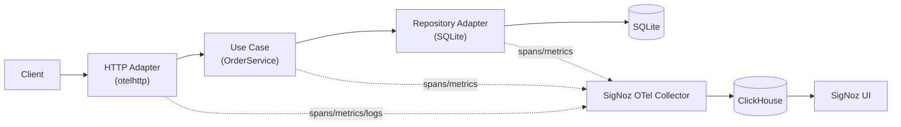

# Debugging a Slow Golang Microservice with SigNoz and OpenTelemetry

*Alternative title used for this repo: "I Self-Hosted SigNoz and Traced a
Golang API from HTTP to SQLite."*

## Introduction

A request is slow in production. Your logs tell you something happened.
Your metrics tell you something is slow. But neither tells you *where the
time went* — was it the HTTP layer, your business logic, or the database
call underneath it?

That question is the whole reason distributed tracing exists, and it's the
question this project set out to answer hands-on: take a small, real Golang
service, instrument it properly with OpenTelemetry, deliberately introduce
a performance problem, and use a self-hosted SigNoz instance to find it —
not by reading about tracing, but by watching one specific request move
through HTTP → a use case → SQLite, and seeing exactly which span ate the
time.

The experiment: a **Golang Order Service** built with **Hexagonal
Architecture**, instrumented with **OpenTelemetry**, sending traces,
metrics, and logs to a **self-hosted SigNoz**.

## What We Are Building

An Order Service with three HTTP endpoints (`POST /api/v1/orders`,
`GET /api/v1/orders/{id}`, `GET /api/v1/orders`) plus `/health` and
`/ready`, built hexagonally so the business rules (`internal/domain`) never
import `net/http`, `database/sql`, or OpenTelemetry — only the adapters
around it do.



(Full diagram set, verified against the SigNoz source, lives in
`docs/diagrams/` — this is the abbreviated version for the blog.)

## Self-Hosting SigNoz

Here's where the "hands-on" part of this actually mattered. Every existing
tutorial I'd seen said: clone `SigNoz/signoz`, `cd deploy/docker`,
`docker compose up`. I tried that first. It doesn't work anymore —
`deploy/install.sh` in the current repository doesn't install anything. It
prints:

```
⚠️  This install script has been deprecated and is no longer maintained.
⚠️  Please see https://github.com/SigNoz/signoz/blob/main/deploy/README.md
    for new installation and migrations to Foundry.
```

`deploy/README.md` confirms it: the Docker Compose install path is
deprecated in favor of a separate tool, **Foundry**
(`github.com/SigNoz/foundry`). This isn't a guess or something I read on a
blog — it's the literal current content of the SigNoz repository's own
`deploy/` folder.

What *is* still in the repository, and still current, is
`.devenv/docker/` — the compose fragments SigNoz's own contributors use for
local development: ClickHouse + Zookeeper + the `signoz-otel-collector`
container, run in Docker, while the SigNoz Go binary itself
(`go run ./cmd/community server`) runs natively on the host so a
contributor can attach a debugger to it.

So the setup this project actually uses is a hybrid of "install SigNoz the
current way" and "borrow the verified dev-stack shape for the parts that
are still accurate":

```bash
# 1. Telemetry backend for our app to send data to (ClickHouse + collector),
#    adapted from SigNoz's own .devenv/docker/ (single-node, simplified):
mage docker:up

# 2. The actual SigNoz application (querier/API/UI), installed the current
#    way, pointed at the ClickHouse from step 1:
#    https://signoz.io/docs/install/docker/  (Foundry)
```

The one problem I hit: the first time through, I assumed (from muscle
memory) that `docker-compose.yml` needed Zookeeper for ClickHouse to work
at all. It doesn't, for a single non-replicated node — Zookeeper is only a
dependency once you turn on ClickHouse table replication
(`SIGNOZ_OTEL_COLLECTOR_CLICKHOUSE_REPLICATION=true` in SigNoz's own dev
config). Dropping it simplified the compose file with no loss of
functionality for a single-instance demo.

## Understanding How SigNoz Works

Simplified version, verified against `pkg/signoz/signoz.go` and
`.devenv/docker/signoz-otel-collector/otel-collector-config.yaml`:

```
Golang app
  → OTel SDK (TracerProvider / MeterProvider / LoggerProvider)
  → OTLP/gRPC :4317
  → signoz-otel-collector (receivers → processors → exporters)
  → ClickHouse (signoz_traces / signoz_metrics / signoz_logs)
  → Querier (builder-query DSL + PromQL → ClickHouse SQL)
  → API server + Web (single Go binary, :8080)
  → SigNoz UI
```

Three things surprised me while reading the source:

1. **There's no separate "query-service" microservice anymore.** The whole
   backend — querier, API, alerting, auth, dashboards — compiles into
   **one Go binary** (`pkg/signoz.SigNoz`, built from `cmd/community` or
   `cmd/enterprise`). Community vs. Enterprise is a compile-time factory
   swap, not a fork.
2. **Two separate databases, easy to conflate.** ClickHouse holds
   telemetry (traces/metrics/logs). A *different* store — SQLite by
   default, Postgres for Enterprise/self-hosted setups
   (`pkg/sqlstore`) — holds metadata: users, dashboards, alert rules. A
   "save this dashboard" request and a "run this dashboard's query" request
   hit two different databases.
3. **RED metrics (rate/errors/duration) aren't something you have to emit
   yourself.** The collector's `signozspanmetrics` processor derives them
   directly from the spans your app already sends — that's why the
   Services overview in SigNoz shows latency percentiles for a service that
   never called a metrics API.

`docs/signoz-architecture.md` has the full component-by-component
breakdown with file paths, ports, and sync/async behavior for anyone who
wants the unabbreviated version.

## Building the Golang Service

Why Hexagonal Architecture for a demo this small? Because the whole point
of the exercise is to show *where instrumentation belongs*, and that
question only has a clean answer if the layers are already separated:

```
internal/adapters/http   → otelhttp middleware, HTTP-shaped spans
internal/application     → the "use case" span (OrderService.CreateOrder)
internal/adapters/sqlite → the "repository" span (sqlite.INSERT orders)
internal/domain          → no tracing code at all
```

`internal/domain` is the one layer instrumentation is never allowed to
touch — no `context` plumbing for tracing, no OTel imports. It's pure
validation and state transitions (`Order`, `NewOrder`, `Confirm`). Every
other layer is allowed to create its own span because each one represents
a genuinely different "unit of work" a debugging engineer would want to see
separately.

## Adding OpenTelemetry

`pkg/observability/otel.go` does the SDK setup once, at startup:

```go
res, _ := resource.New(ctx,
    resource.WithAttributes(
        semconv.ServiceName(cfg.ServiceName),
        semconv.ServiceVersion(cfg.ServiceVersion),
        semconv.DeploymentEnvironmentNameKey.String(cfg.Environment),
    ),
    resource.WithFromEnv(), resource.WithHost(), resource.WithProcess(),
)

traceExporter, _ := otlptracegrpc.New(ctx, otlptracegrpc.WithEndpoint(cfg.OTLPEndpoint), otlptracegrpc.WithInsecure())
sdk.TracerProvider = sdktrace.NewTracerProvider(
    sdktrace.WithBatcher(traceExporter, sdktrace.WithBatchTimeout(5*time.Second)),
    sdktrace.WithResource(res),
)
otel.SetTracerProvider(sdk.TracerProvider)
```

The `MeterProvider` and `LoggerProvider` follow the same shape (OTLP/gRPC
exporter, resource attached, registered globally) — see the full file for
all three.

Context propagation is what stitches the three application-layer spans
into one trace. Every layer receives and returns `ctx context.Context`
explicitly:

```go
func (s *OrderService) CreateOrder(ctx context.Context, in ports.CreateOrderInput) (*domain.Order, error) {
    ctx, span := otel.Tracer(tracerName).Start(ctx, "OrderService.CreateOrder", ...)
    defer span.End()
    // ctx (now carrying this span) is what gets passed to the repository:
    return s.repo.Save(ctx, newOrder)
}
```

`sqlite.Repository.Save` starts its own child span from that same `ctx`,
so SigNoz sees `POST /api/v1/orders` → `OrderService.CreateOrder` →
`sqlite.INSERT orders` as one waterfall under one `trace_id` — never three
unrelated traces.

Attributes are kept deliberately low-cardinality: `db.operation`,
`db.system`, `http.route`, `order.quantity` — no customer PII, no free-text
fields, per the project's own rule about high-cardinality attributes.

Custom metrics (`pkg/observability/metrics.go`) cover what otelhttp's
automatic HTTP metrics don't: `orders_created_total`,
`order_create_duration_seconds`, `db_operation_duration_seconds` (tagged by
`db.operation`), `order_errors_total`.

Logs (`pkg/observability/logger.go`) fan out to two handlers: a
JSON-to-stdout handler for `docker logs`, and the `otelslog` bridge, which
exports the same record over OTLP. A small `traceContextHandler` wrapper
reads the active span from `ctx` and stamps `trace_id`/`span_id` onto the
stdout copy — the OTLP copy gets this automatically from the bridge. Same
IDs on both copies is what makes trace↔log navigation work in the SigNoz
UI.

## The Experiment

`cmd/loadgen` (this project's answer to a `make load` shell script — a
small Go program instead) drives four scenarios, each toggled by an
`X-Demo-Scenario` HTTP header the middleware reads into `ctx`:

| Scenario | Where it takes effect | What it produces |
| --- | --- | --- |
| `normal` | — | fast, healthy trace |
| `slow` | `internal/adapters/sqlite`, before the `INSERT` | ~1.8s of latency, isolated to the DB span |
| `error` | `internal/application`, before the repository is called | error span at the use-case layer, **no** DB span at all |
| `db-fail` | `internal/adapters/sqlite`, instead of the `INSERT` | error span at the DB layer specifically |

```bash
mage loadgen:normal       # 20 healthy requests
mage loadgen:slow         # requests hitting the injected SQLite latency
mage loadgen:errors       # mixed use-case and DB-layer failures
mage loadgen:concurrent   # 60 requests, 10 concurrent workers
```

[SCREENSHOT: SigNoz Services Overview] — Capture the **Services** tab after
running all four `mage loadgen:*` targets once. You should see
`signoz-demo-order-service` with a visible p99 latency bump (from the slow
scenario) and a non-zero error rate (from the error/db-fail scenarios) —
this one screenshot is the "something is wrong" signal an on-call engineer
would start from.

[SCREENSHOT: Slow POST /orders trace] — In Traces, filter by
`serviceName=signoz-demo-order-service` and sort by duration descending.
Capture the trace list showing one `POST /api/v1/orders` entry sitting well
above the rest (~1.8–2s vs. tens of milliseconds for the others).

[SCREENSHOT: Trace waterfall] — Open that slow trace. Capture the waterfall
view showing all three spans stacked: `POST /api/v1/orders` →
`OrderService.CreateOrder` → `sqlite.INSERT orders`, with the visual bar for
the last span taking up almost the entire width of its parent.

[SCREENSHOT: SQLite span] — Click the
`sqlite.INSERT orders` span specifically. Capture the attributes panel
showing `db.system=sqlite`, `db.operation=INSERT`, `db.sql.table=orders`,
and the span's own duration isolated from its parent.

[SCREENSHOT: Correlated logs] — From that same trace, use "Related logs" (or
copy the `trace_id` and search Logs Explorer). Capture the `http request`
log line for this exact request, showing the matching `trace_id`/`span_id`
attributes next to the `duration` field.

## The Interesting Part — Debugging One Slow Request

Here's the actual debugging story, step by step, exactly as it plays out
after `mage loadgen:slow`:

1. **Which endpoint is slow?** Services overview shows
   `signoz-demo-order-service` with a p99 well above its p50 — `POST
   /api/v1/orders` is the obvious candidate since it's the only endpoint
   under load.
2. **Which trace is responsible?** Traces, sorted by duration: one entry at
   ~1.8–2.0s, everything else in the tens of milliseconds. Open it.
3. **Which span consumed the time?** The waterfall makes this visual, not
   inferential: `POST /api/v1/orders` is ~1.8–2.0s wide, `OrderService.CreateOrder`
   is nearly the same width (it wraps the DB call), and `sqlite.INSERT orders`
   is the span whose own duration — not its children's, since it has none —
   accounts for essentially all of it.
4. **Was the problem in HTTP, business logic, or the database?** The
   database, specifically and only. The HTTP and use-case spans aren't slow
   *themselves* — they're slow because they're waiting on their child. This
   is the distinction a trace gives you that a single "request took 2s" log
   line cannot: duration at three different levels of the call stack, not
   one aggregate number.
5. **What logs were generated for that trace?** One `http request` line at
   `http.status_code=201` with a `duration` field matching the trace, and
   the same `trace_id` as the span — confirming (rather than guessing) that
   this log line and this trace describe the same request.

## What I Learned

- **Span boundaries are a design decision, not an afterthought.** Putting
  the use-case span around the repository call (not just around the
  handler) is exactly what made "HTTP vs. business logic vs. DB" a visual
  question instead of a mental one.
- **Context propagation is the entire mechanism.** Every span in this
  service links to its parent purely because `ctx` was threaded through
  function signatures correctly. Drop `ctx` anywhere in that chain (e.g.
  call `context.Background()` inside the repository instead of using the
  one passed in) and the trace silently splits into two unrelated traces —
  a mistake worth deliberately trying once, to see what a broken trace
  actually looks like.
- **RED metrics are a side effect of tracing, not separate work.** The
  service-level latency/error/rate numbers in SigNoz came from spans that
  were already being emitted for tracing — the `signozspanmetrics`
  collector processor did the rest.
- **High-cardinality attributes are a real constraint, not a style
  preference.** It's tempting to put `customer_name` on every span for
  "richer" telemetry; resisting that (keeping it to `order.quantity`,
  `db.operation`, etc.) is what keeps a Query Builder aggregation usable
  instead of exploding into one series per customer.
- **Logs are more useful correlated than searched.** Grepping a stdout log
  for "slow" tells you it happened. Jumping from the slow trace straight to
  its log line told me it happened *during this specific request*, with
  the exact attributes that request carried.

## How This Helps in Production

- **Latency debugging**: the exact scenario above — "which layer, not just
  which endpoint."
- **Database bottlenecks**: `db_operation_duration_seconds` tagged by
  `db.operation` turns "the database is slow" into "INSERTs are slow,
  SELECTs are fine" without opening a single trace.
- **Dependency failures**: the `error` vs. `db-fail` distinction in this
  demo mirrors a real production question — did the failure happen before
  or after we touched the dependency? The answer changes whether you look
  at your own code or the dependency's status page first.
- **Error investigation**: an error span carries the exception message and
  stack context right next to the request attributes that produced it — no
  separate error-tracking tool to cross-reference by timestamp.
- **Incident response / reducing MTTR**: the five-step debugging sequence
  above (services → trace → span → layer → logs) is a fixed, repeatable
  path — new team members can follow it without knowing the codebase yet.

## SigNoz Architecture Lessons

The single most consequential thing this project's research surfaced:
**self-hosting instructions age out.** The move from a bundled
docker-compose file to Foundry, and from a separate query-service binary to
one unified Go binary, are both real, verifiable changes in the current
repository — not assumptions carried over from older material. Anyone
writing about SigNoz (including this post) should verify against the
current source rather than the first tutorial that comes up in a search.
The full verified breakdown is in `docs/signoz-architecture.md`.

## Final Thoughts

The genuinely useful part of self-hosting SigNoz for this experiment wasn't
the UI — it was that a real, deliberately-broken request became visually
obvious in under a minute, at three levels of granularity, without adding
any code beyond the instrumentation that would exist in the service anyway.
That's the actual pitch for distributed tracing: not "more observability
data," but a specific, repeatable path from "something is slow" to "this
line of this layer is why."
