# Diagram 1 — High-Level SigNoz Architecture

Traces, metrics, and logs from instrumented applications flow through OTLP into
the SigNoz Collector, land in ClickHouse, and are queried back out by the
unified SigNoz backend for the UI.

```mermaid
flowchart LR
    subgraph Apps["Applications / Microservices"]
        A1["Golang Order Service<br/>(this demo)"]
        A2["Other instrumented services"]
    end

    subgraph SDK["OpenTelemetry SDK"]
        S1["TracerProvider"]
        S2["MeterProvider"]
        S3["LoggerProvider"]
    end

    A1 -->|"instrumented calls"| S1
    A1 --> S2
    A1 --> S3
    A2 --> S1

    S1 -->|"OTLP/gRPC :4317<br/>or OTLP/HTTP :4318"| OTLP["OTLP"]
    S2 --> OTLP
    S3 --> OTLP

    OTLP --> COL["SigNoz OTel Collector<br/>(signoz-otel-collector)"]

    subgraph Pipeline["Processing Pipeline"]
        P1["receivers: otlp, prometheus"]
        P2["processors: signozspanmetrics,<br/>resourcedetection, batch"]
        P3["exporters: clickhousetraces,<br/>signozclickhousemetrics,<br/>clickhouselogsexporter"]
    end

    COL --> P1 --> P2 --> P3

    P3 -->|"traces"| CH1[("ClickHouse<br/>signoz_traces")]
    P3 -->|"metrics"| CH2[("ClickHouse<br/>signoz_metrics")]
    P3 -->|"logs"| CH3[("ClickHouse<br/>signoz_logs")]

    subgraph Backend["SigNoz Backend (single Go binary)"]
        Q["Querier<br/>(builder-query DSL + PromQL)"]
        API["API Server + Web<br/>(pkg/apiserver, pkg/web) :8080"]
        META[("SQLStore<br/>SQLite/Postgres<br/>users, dashboards, alert rules")]
        RULER["Ruler + Alertmanager<br/>(alerting)"]
    end

    CH1 --> Q
    CH2 --> Q
    CH3 --> Q
    Q --> API
    META <--> API
    Q --> RULER
    RULER --> META

    UI["SigNoz UI<br/>(frontend/, served by pkg/web)"]
    API --> UI
    UI -->|"HTTP :8080"| Browser["Browser"]
```

**Facts vs. simplification**

- Ports, component names, and the OTLP→Collector→ClickHouse→Querier→API/UI
  flow are verified from source (see `docs/signoz-architecture.md`).
- "Other instrumented services" is illustrative only — this demo ships one
  Golang service.
