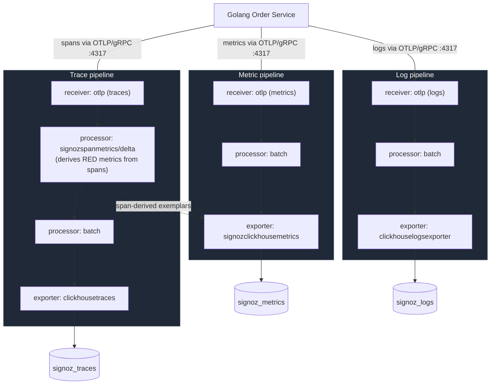

# Diagram 2 — Telemetry Ingestion Pipeline (Traces / Metrics / Logs)

How each signal travels from the Golang Order Service into SigNoz's storage,
shown as three parallel lanes through the same collector.

**Notes (verified from `.devenv/docker/signoz-otel-collector/otel-collector-config.yaml`)**

- All three signals arrive over the **same** OTLP receiver (`grpc: 0.0.0.0:4317`,
  `http: 0.0.0.0:4318`) — the "lanes" above are pipeline names in the
  collector's `service.pipelines` config, not separate network listeners.
- `signozspanmetrics/delta` is the one processor that bridges traces →
  metrics: it computes latency histograms and request/error counts from
  spans and feeds them into the metrics exporter — this is how SigNoz gets
  RED-method service metrics without the app emitting them directly.
- A `prometheus` receiver also feeds the metrics pipeline (self-scraping the
  collector's own `:8888` metrics) — omitted above since it's not part of
  the application's data path.
