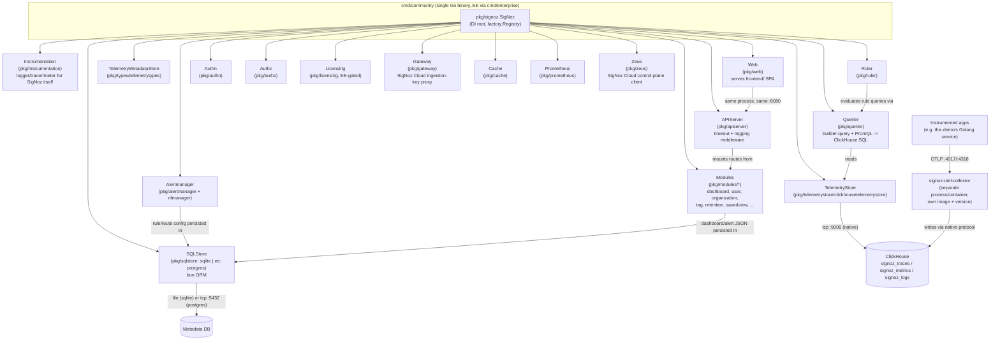

# Diagram 4 — SigNoz Internal Component Architecture (current repo)

Transcribed directly from `pkg/signoz/signoz.go`'s `SigNoz` struct and the
factories it wires in `signoz.New(...)`. Component names are the actual Go
package/struct names — nothing invented.

**Why this matters for the blog**

- There is **no separate "query-service" microservice anymore** — that
  legacy package path (`pkg/query-service/app`) still contains some
  handlers (e.g. Service Map), but it's compiled into the same binary as
  everything else, not deployed separately.
- The **Collector is architecturally decoupled** from the SigNoz binary —
  different repo entirely (`signoz/signoz-otel-collector`), different
  release cadence, connected only via ClickHouse and OTLP.
- **Licensing/Gateway/Zeus** are SaaS-integration surfaces present even in
  the OSS binary (feature-gated), which is why `cmd/enterprise` is a thin
  wrapper rather than a separate codebase.
