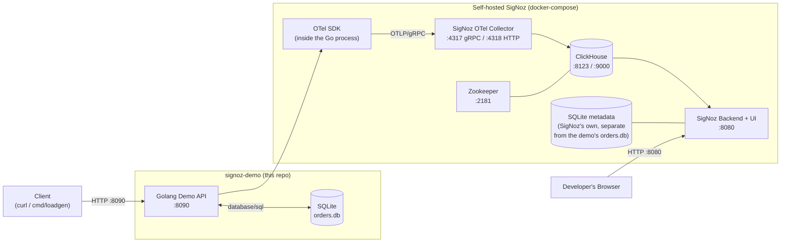

# Diagram 5 — Local Development Architecture (this repo)

What actually runs on a laptop when you follow this repo's README: the demo
API + its own SQLite business database, plus a self-hosted SigNoz stack
modeled on `.devenv/docker/` from the SigNoz repo.

**Simplification notes [SIMPLIFICATION]**

- The demo API's `orders.db` (business data) and SigNoz's own metadata
  SQLite file are two unrelated SQLite databases — they are drawn separately
  on purpose so they are never confused.
- This diagram matches `docker-compose.yml` in this repo: `app`,
  `signoz-otel-collector`, `clickhouse`, `zookeeper`, `signoz` services.
- A production SigNoz deployment would use Foundry/Kubernetes and typically
  Postgres for metadata + a multi-node ClickHouse cluster — not shown here,
  out of scope for a local demo.
- The `SigNoz Backend + UI` box is provisioned via **Foundry**
  (`signoz.io/docs/install/docker/`), not a hand-rolled compose service —
  see `docs/signoz-architecture.md` §2.10 for why: the classic root
  `docker-compose.yaml` self-host method was deprecated by SigNoz itself.
  `docker-compose.yml` in this repo provisions everything *except* that box
  (ClickHouse, Zookeeper, the collector, and our own app).
